# Soft_Imperio

### Flujo de despliegue


[Archivo excalidraw editable](./Documentation/deploy-flow.excalidraw)

### Diagrama de Arquitectura


[Archivo excalidraw editable](./Documentation/Diagrama%20Arquitectura%20.excalidraw)

### Api GateWay


[Archivo excalidraw editable](./Documentation/deploy-flow.excalidraw)

## Diagramas de secuencias

### Autenticación


### Punto de venta en Mesa


### Punto de venta en Barra


## Despliegue

### Crear una instancia EC2 ubuntu

Seguir los pasos del siguiente sitio para crear la instancia EC2:

[Crear instancia EC2](https://dev.to/jeptoo/how-to-create-ec2-instance-ubuntu-2204-on-aws-and-connect-via-ssh-using-pem-492o)

### Conectarse a la instancia

1. buscamos EC2
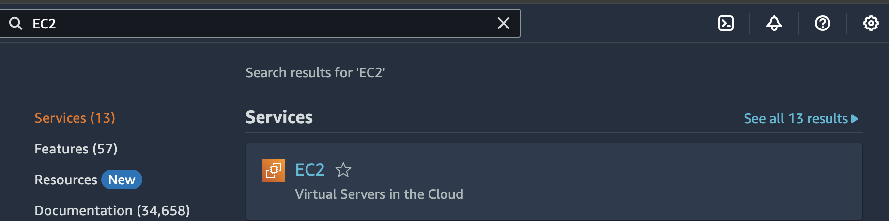

2. Seleccionamos EC2
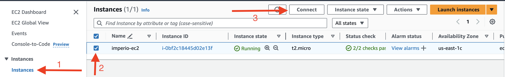

3. Nos conectamos a la instancia por el navegador (esto nos abre una ventana nueva)
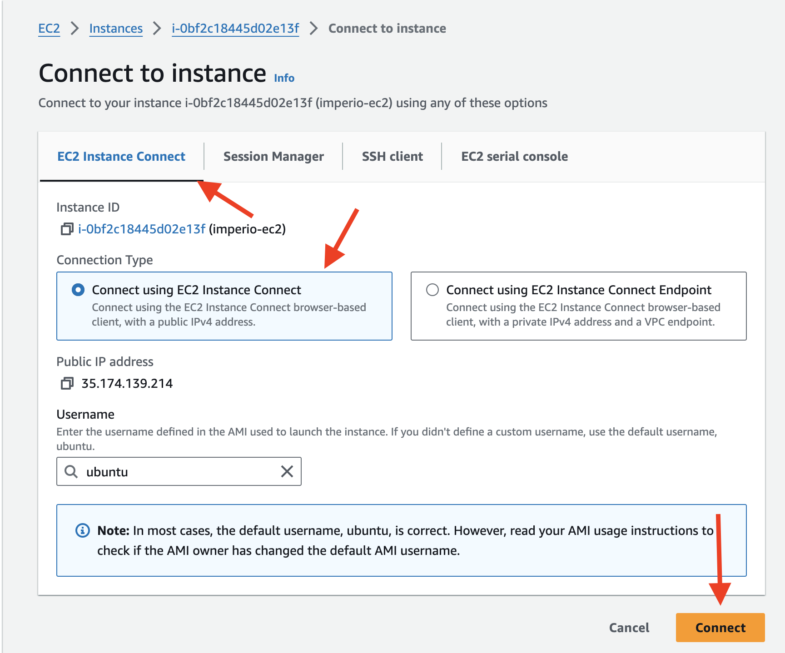

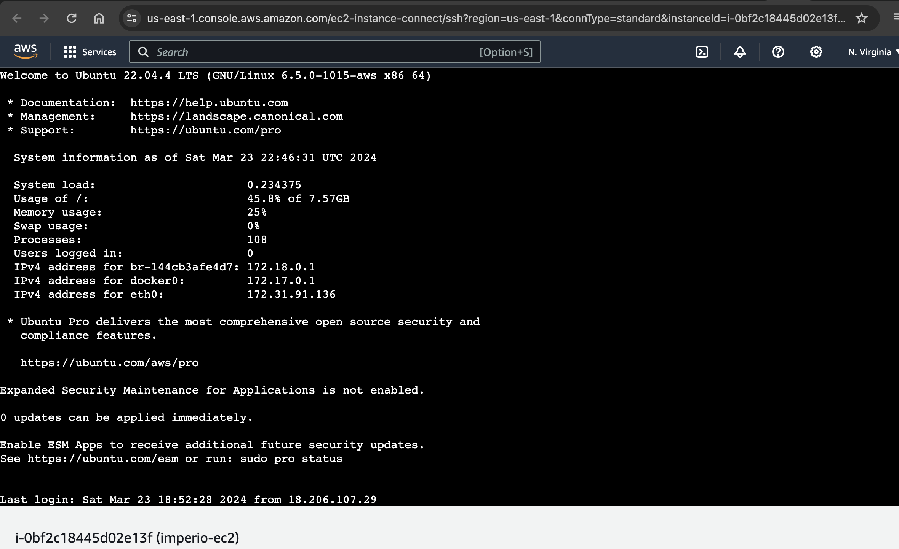


### Configuración Nginx en instancia EC2 ubuntu

1. Una vez dentro de la instancia EC2 lanzamos los siguientes comandos:

1.1. Para actualizar o parchar la linea base del sistema operativo ubuntu

```sudo apt update && sudo apt upgrade```

Si en ocaciones la pantalla se pone así, nos movemos con la tecla ```tabulador``` hasta ```ok``` y precionamos ```enter```

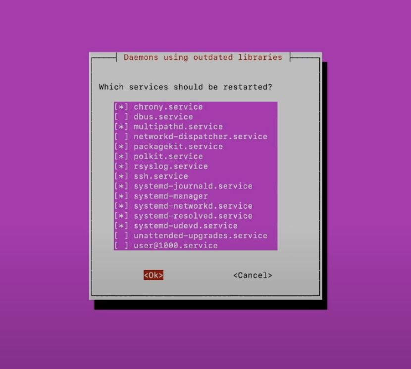 

1.2. Instalamos el servidor Nginx

```sudo apt install nginx```

1.3. Validamos la instalación de Nginx, abriendo en el navegador la url publica que nos proporciona la instancia EC2. Al seguir los pasos de la imagen en el navegador cambiamos ```https``` por ```http``` y agregamos un ```/``` al final. 
Ejemplo ```http://ec2-18-212-187-130.compute-1.amazonaws.com/```


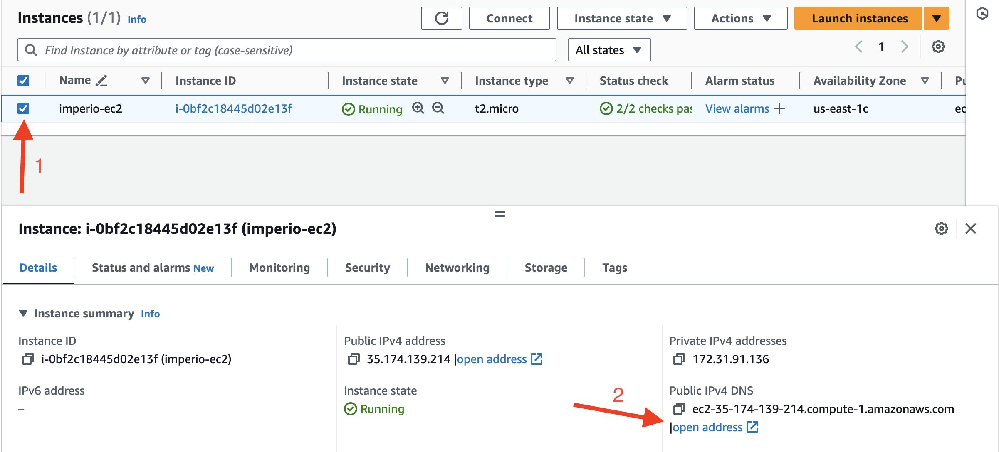 

El resultado será este al abrir la url en el navegador:

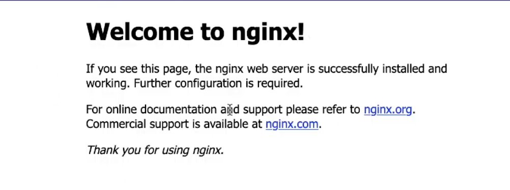 

1.4. Regresamos a la pestaña del navegador donde estamos conectados a la instancia EC2 para eliminar el ```html``` que visualizamos en la imagen anterior.

* Dentro de la instancia ejecutamos:

```cd /var/www/html/```

```ls``` con esto vemos el archivo ```.html``` el cual vamos a eliminar

```sudo rm nombreArchivo.html``` cambiar ```nombreArchivo``` por el nombre del archivo que visualizamos arriba

```ls``` para asegurarnos que ya no aparezca el archivo

1.5. Subimos a la instancia EC2 todos los archivos front web del proyecto

Estos archivos ```html``` ```css``` ```js``` deben quedar en la ruta ```/var/www/html/```

* Otorgamos permisos a otros usuarios para ```/var/www/html/``` para poder crear o eliminar archivos, ejecutando:

```sudo chown -R $USER:$USER /var/www/html/```

```sudo chmod -R 755 /var/www/html/```

* Para subir los archivos a la instancia EC2 nos ayudamos de ```Github Actions```, usando ```Rsync Deployments Action```

- Creamos un archivo en nuestro repositorio de github en la ruta ```.github/workflows/upload-front.yaml``` [upload-front.yaml](https://github.com/TatianaHoyos/SoftImperio/blob/main/.github/workflows/upload-front.yaml)

- El archivo contendrá la tarea:

```yaml
- name: 📂 rsync Upload front
    uses: burnett01/rsync-deployments@5.1
    with:
      switches: -avzr --delete
      path: Frontend/WEB/*
      remote_path: /var/www/html/
      remote_host: <host de instancia EC2>
      remote_user: ubuntu
      remote_key: "${{ secrets.SSH_PRIVATE_KEY_EC2 }}"
```

Allí hay que reemplazar el valor ```<host de instancia EC2>``` por el host que nos proporciona la instancia EC2 (este host cambia cada vez que se apaga e inicia la instancia).

La propiedad ```path: Frontend/WEB/*``` será la ruta donde están alojados los archivios front web en nuestro repositorio que queremos subir a la instancia EC2

La variable ```SSH_PRIVATE_KEY_EC2``` se debe crear en la sección de secrets de github (el contenido del archivo .pem [la llave] que se descargó al momento de crear la instancia EC2), de esta forma:

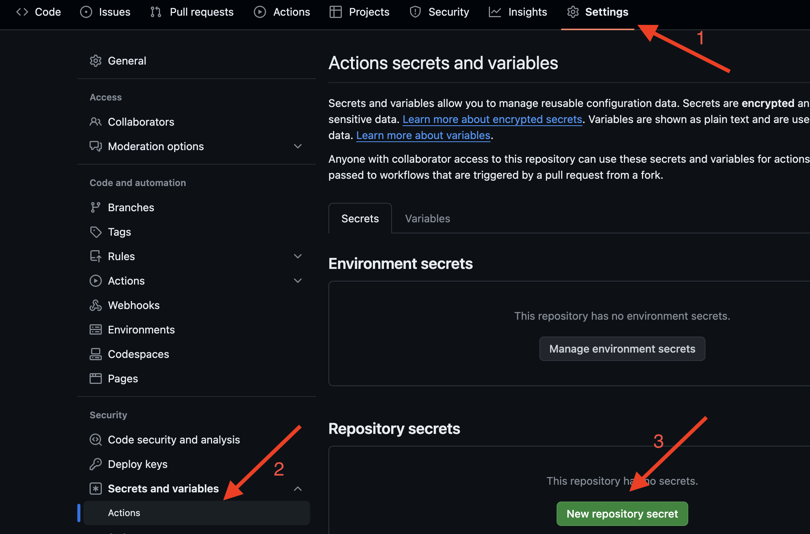 

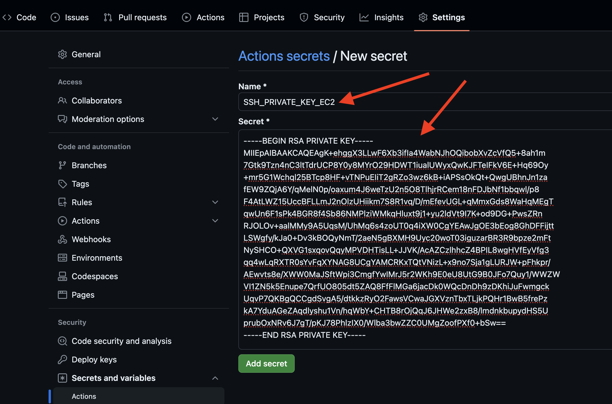 
 
- Una vez creado el archivo ```.github/workflows/upload-front.yaml``` e integrado al branch ```main``` encontraremos la ejecución del github action acá

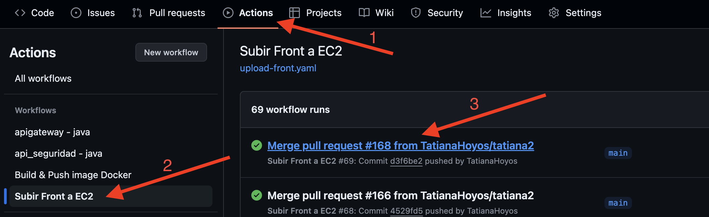 

Si la ejecución fue exitosa, nuestros archivos front web estarán en la instancia EC2

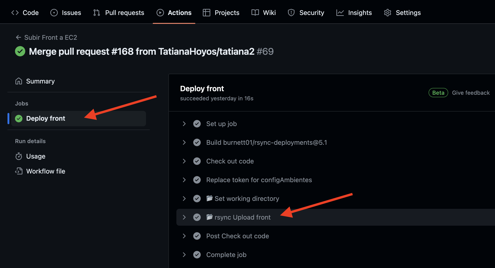 

- En la instancia EC2 verificamos si están los archivos.

```cd /var/www/html/```

```ls```

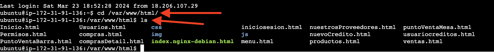 

- Ahora en el navegador podemos acceder a nuestro ```.html``` principal, sólo hacemos el paso ```1.3.``` y agregamos en la url el nombre del archivo ejemplo ```http://ec2-18-212-187-130.compute-1.amazonaws.com/iniciosesion.html```

1.6. Configurar nginx

- Si nuestro sitio no tiene un ```index.html``` podemos cofiguarar que cuando ingresemos al dns de la instancia EC2 abra un archivo ```.html``` por defecto:

- Editamos el archivo ```/etc/nginx/sites-available/default```

```sudo nano /etc/nginx/sites-available/default```  acá podemos editar el archivo desde la terminal

Podemos usar las teclas de ```flecha hacia arriba, abajo, derecha e izquierda ``` para desplazarnos en el archivo, para confirguar algun cambio precionamos la combinación de teclas ```ctrl + o``` luego ```Enter``` y por último ```ctrl + x```

identificamos la linea: 
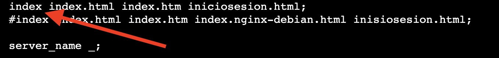 

y podemos nuestro archivo principal así ```index index.html index.htm iniciosesion.html;``` de esta forma si no encuentra un ```index.html``` buscará ```iniciosesion.html```

- Configurar los ```cors``` (seguimos editando el archivo ```/etc/nginx/sites-available/default```)

identificamos la linea: 
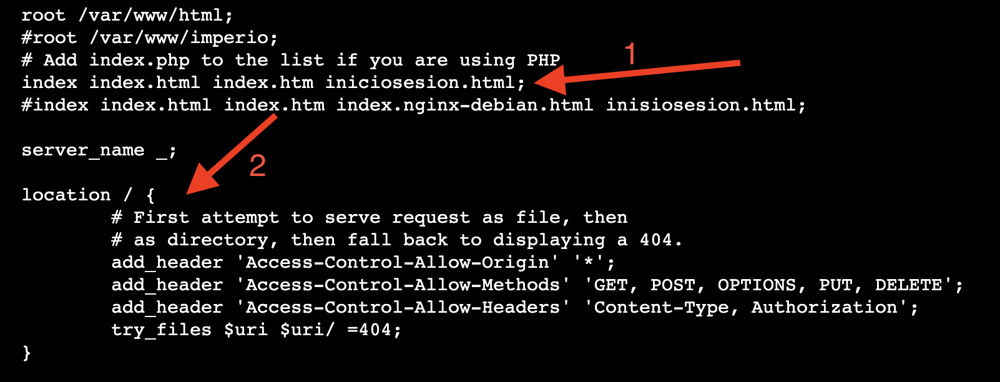 

y pegamos lo siguiente:

```
location / {
        add_header 'Access-Control-Allow-Origin' '*';
        add_header 'Access-Control-Allow-Methods' 'GET, POST, OPTIONS, PUT, DELETE';
        add_header 'Access-Control-Allow-Headers' 'Content-Type, Authorization';
        try_files $uri $uri/ =404;
}
```

Guardamos la configuración precionamos la combinación de teclas ```ctrl + o``` luego ```Enter``` y por último ```ctrl + x```

Ahora podemos disfrutar de nuestro sitio web alojado en una instancia EC2